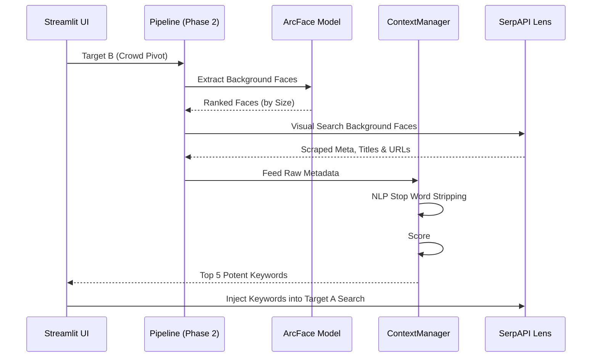
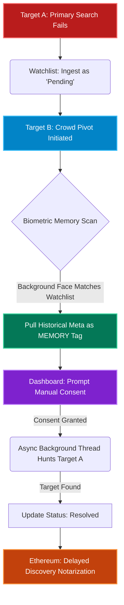

<div align="center">

# FaceTrace (SocialDetective)

### Autonomous Biometric OSINT Facial Recognition, Decentralized Web3 Knowledge Graph & Immutable Blockchain Notarization

[](https://python.org)
[](https://github.com/deepinsight/insightface)
[](https://onnxruntime.ai)

[](https://ipfs.tech)
[](https://sepolia.etherscan.io/address/0xe25BfF359d31b3E2B3fF99692E6cE025f273BC21)
[](https://soliditylang.org)
[](https://web3py.readthedocs.io)

[](https://serpapi.com)
[](https://streamlit.io)
[](https://yandex.com/images)
[](https://duckduckgo.com)
[](https://instagram.com)
[](https://x.com)
[](https://linkedin.com)

[](https://pytest.org)
[](https://en.wikipedia.org/wiki/SHA-2)
[](LICENSE)

<br/>

**A production-grade forensic OSINT framework bridging deep facial biometrics, zero-CAPTCHA visual reverse search, decentralized IPFS collective memory, and immutable Ethereum blockchain notarization.**

</div>

---

## Table of Contents

- [Overview & Key Highlights](#overview--key-highlights)
- [7-Phase Forensic Pipeline](#7-phase-forensic-pipeline)
- [Decentralized Web3 Collective Memory](#decentralized-web3-collective-memory)
- [System Architecture](#system-architecture)
- [Technical Capabilities & Engineering Deep Dive](#technical-capabilities--engineering-deep-dive)
  - [1. Biometric Precision & 512-d ArcFace Alignment](#1-biometric-precision--512-d-arcface-alignment)
  - [2. Multi-Engine Visual Search & Zero-CAPTCHA Architecture](#2-multi-engine-visual-search--zero-captcha-architecture)
  - [3. Dynamic OSINT Discovery & Contextual Dorking](#3-dynamic-osint-discovery--contextual-dorking---context)
  - [4. Deep Instagram Video Reels & Carousel Unpacking](#4-deep-instagram-video-reels--carousel-unpacking)
  - [5. Multi-Platform Identity Profiling](#5-multi-platform-identity-profiling---handle)
  - [6. Cross-Platform Username Sweeps (WhatsMyName)](#6-cross-platform-username-sweeps-whatsmyname)
  - [7. LinkedIn Public Post Harvesting](#7-linkedin-public-post-harvesting)
  - [8. Multimodal Scene Analysis & GEOINT](#8-multimodal-scene-analysis--geoint)
- [Blockchain Architecture: Ethereum Sepolia](#blockchain-architecture-ethereum-sepolia)
- [Quickstart & Setup Guide](#quickstart--setup-guide)
  - [Prerequisites](#1-prerequisites)
  - [Installation & Virtual Environment](#2-installation--virtual-environment)
  - [GPU Acceleration (NVIDIA CUDA)](#3-gpu-acceleration-nvidia-cuda-optional)
  - [Environment Configuration](#4-environment-configuration)
  - [Execution Workflows (A through H)](#5-execution-workflows)
- [Independent Verification & Tamper Detection](#independent-verification--tamper-detection)
- [Known Limitations & Engineering Boundaries](#known-limitations--engineering-boundaries)
- [Demonstration & Audit Walkthrough](#demonstration--audit-walkthrough)
- [Repository Structure](#repository-structure)
- [Testing & Performance Validation](#testing--performance-validation)
- [Privacy, Ethics & Responsible Disclosure](#privacy-ethics--responsible-disclosure)
- [License](#license)

---

## Overview & Key Highlights

Commercial facial search engines hoard indexed identity associations behind expensive subscription paywalls and proprietary servers. When an investigator uncovers evidence, traditional platforms offer no mathematical guarantee that scraped posts, timestamps, or media haven't been retroactively manipulated.

**FaceTrace (SocialDetective)** resolves both challenges:

1. **Free, Decentralized Collective Intelligence**: Transforms forensic identity discovery into an open, community-indexed knowledge graph. Findings are packaged into deterministic IPFS payloads (`bafkrei...`) and synchronized across participants via Ethereum Sepolia event logs (`--sync-web3`). Zero central servers or proprietary database lock-ins.
2. **Cryptographic Proof of Authenticity**: Packages acquired posts into canonical, key-sorted RFC-compliant payloads, computes a 32-byte SHA-256 fingerprint, and permanently seals the evidence on Ethereum Sepolia via a dedicated Solidity smart contract.
3. **Instant Tamper Verification**: Anyone holding a forensic dossier can independently query the blockchain. If a single pixel, timestamp, handle, or caption character is altered, verification fails immediately with `✗ TAMPER DETECTED`.

<br/>

### Core Architectural Pillars

| Pillar | Implementation | Technical & Forensic Utility |
| :--- | :--- | :--- |
| **Biometric Face Intake** | **InsightFace** (`buffalo_l` model pack) generating normalized **512-d ArcFace embeddings**. | Pose-invariant ($\pm 45^\circ$), illumination-resistant geometric representations for high-precision face matching. |
| **Zero-CAPTCHA Visual Search** | Multi-engine cascade: **SerpAPI Google Lens** $\rightarrow$ **Offscreen Headless Lens** $\rightarrow$ **Direct Yandex Images**. | Bypasses Google bot challenges via raw multipart `/v3/upload` dispatches and offscreen session rendering. |
| **Decentralized Collective Memory** | Shared **Identity Knowledge Graph** backed by **IPFS CIDv1** and **Sepolia Contract Event Sync** (`--sync-web3`). | Eliminates centralized backends. Any researcher can sync, query, and enrich the shared biometric graph. |
| **Crowd-Context Search (C3)** | Asynchronous Watchlist indexing, background face extraction, and Memory Tag prioritization (`[MEMORY]`). | Salvages dead-end searches by tracking pending targets and resolving them via metadata scraped from background faces in subsequent crowds. |
| **Multimodal Scene & GEOINT** | Contextual terrain, architectural, and environmental feature estimation via `app/geo.py`. | Extracts background features and lighting clues to assist physical geolocation hypotheses. |
| **Deterministic Hashing** | RFC-compliant canonical key-sorted JSON packaging + **32-byte SHA-256 fingerprint**. | Guarantees mathematical immutability and byte-level integrity verification across environments. |
| **Immutable Notarization** | **`ContentRegistry.sol` (Solidity 0.8.19)** deployed on **Ethereum Sepolia Testnet** with IPFS CID anchoring. | Permanent, decentralized timestamping and delayed-discovery provenance proofs without storing private biometric data on-chain. |
| **Independent Verification** | Standalone verification CLI (`facetrace verify --record <path>`) querying Sepolia contract state. | Immediate tamper alert (`✗ TAMPER DETECTED`) if any text, author, URL, or image pixel was altered post-registration. |

---

## 7-Phase Forensic Pipeline

```
  [1] BIOMETRIC INTAKE        Query portrait input ➔ 5-point landmark alignment ➔ 512-d ArcFace vector
           │
           ▼
  [2] MEMORY LOOKUP           Local Identity Knowledge Graph vector search (cosine similarity pre-lookup)
           │
           ▼
  [3] MULTI-ENGINE SEARCH     SerpAPI Google Lens ➔ Headless Zero-CAPTCHA Lens ➔ Yandex ➔ Social Sweeps
           │                    (If Failed ➔ Ingest to Watchlist & Trigger Crowd Context Pivot)
           ▼
  [4] BIOMETRIC MATCHING      Candidate face extraction ➔ Cosine similarity ranking (e.g. 97.5% match)
           │
           ▼
  [5] CANONICAL PACKAGING     RFC key-sorted JSON + SHA-256 fingerprint + IPFS CIDv1 (bafkrei...)
           │
           ▼
  [6] BLOCKCHAIN ANCHORING    Sign Sepolia tx ➔ Anchor contentHash & platform|ipfs://<cid> in ContentRegistry.sol
           │                    (Supports Delayed Discovery timeline if resolved from Watchlist)
           ▼
  [7] AUDIT & VERIFICATION    Independent verification check: Local Digest == On-Chain Digest
```

<br/>

### Pipeline Execution Breakdown

- **Phase 1 — Biometric Intake & Scene Intelligence**:
  Detects faces using InsightFace `buffalo_l`, performs 5-point landmark alignment, extracts a normalized 512-dimensional ArcFace vector, and calculates scene environmental attributes.

- **Phase 2 — Decentralized Web3 Memory Pre-Lookup**:
  Queries the local vector index (`data/memory/knowledge_graph.json`) using cosine similarity. If the face matches a previously notarized subject, prior handles and platform links are recalled immediately.

- **Phase 3 — Dynamic Multi-Engine Visual Search Cascade**:
  Dispatches reverse image searches across SerpAPI Google Lens, Headless Stealth Google Lens, Yandex Images, Instagram Reels/Carousels, X/Twitter, and LinkedIn.
  *Note: If search yields 0 candidates, the target is ingested into the **C3 Watchlist** as "pending". A **Crowd Pivot** can then extract context tags from background faces to rescue the search.*

- **Phase 4 — Biometric Matching & Ranking**:
  Harvests candidate images, locates candidate faces, extracts ArcFace embeddings, computes cosine similarity scores ($S_C = \frac{\mathbf{u} \cdot \mathbf{v}}{\|\mathbf{u}\|_2 \|\mathbf{v}\|_2}$), and identifies the top match exceeding the threshold.

- **Phase 5 — Canonical Packaging & IPFS Fingerprinting**:
  Gathers author information, post text, and media bytes into an RFC-compliant canonical JSON payload. Computes a deterministic IPFS CIDv1 (`bafkrei...`) and a 32-byte SHA-256 digest (`bytes32`).

- **Phase 6 — Blockchain Notarization & Memory Consolidation**:
  Submits an Ethereum Sepolia transaction invoking `registerRecord(contentHash, "platform|ipfs://<cid>")` on `ContentRegistry.sol`, then records the transaction receipt in the local forensic dossier and knowledge graph. If the target was resolved from the Watchlist, the timeline (`initial_timestamp->resolved_timestamp`) is immutably anchored.

- **Phase 7 — Independent Verification Audit**:
  Re-computes the canonical hash from local files, queries the Sepolia smart contract, and validates authenticity (`✓ CONTENT VERIFIED` or `✗ TAMPER DETECTED`).

---

## Decentralized Web3 Collective Memory

Traditional facial recognition platforms maintain centralized, proprietary databases. FaceTrace uses a decentralized peer-to-peer memory model where verified findings are shared openly without vendor lock-in.

<br/>

```
                           ┌────────────────────────────────────────┐
                           │        Ethereum Sepolia Testnet        │
                           │    ContentRegistry.sol (0xe25BfF35...) │
                           │                                        │
                           │    Event RecordRegistered(             │
                           │      bytes32 contentHash,              │
                           │      uint256 timestamp,                │
                           │      string "platform|ipfs://bafk..."  │
                           │    )                                   │
                           └───────────────────┬────────────────────┘
                                               │
                                               │  Paginated eth_getLogs
                           On-Chain Event Sync │  (--sync-web3)
                                               ▼
                           ┌────────────────────────────────────────┐
                           │            Web3MemorySyncer            │
                           │  • Scans Sepolia Contract Event Logs   │
                           │  • Extracts Decentralized IPFS CIDs    │
                           │  • Resolves via Public IPFS Gateways   │
                           └───────────────────┬────────────────────┘
                                               │
                                               │  Hydrate Verified Identities
                                               ▼
                           ┌────────────────────────────────────────┐
                           │         IdentityKnowledgeGraph         │
                           │  • 512-d ArcFace Biometric Index       │
                           │  • Creator Profiles & Social Handles   │
                           │  • Associated Evidence Records         │
                           │  • Synced to data/memory/              │
                           └────────────────────────────────────────┘
```

<br/>

### How Decentralized Synchronization Operates

1. **Deterministic IPFS Packaging (`IPFSClient`)**:
   When a candidate post is confirmed, its forensic payload (metadata, post URLs, timestamps, author information, and 512-d biometric embedding) is formatted into canonical JSON. The payload is converted into an **IPFS CIDv1** identifier (`bafkrei...` via sha256-raw codec) and cached in `data/memory/ipfs_cache/`.

2. **On-Chain Event Anchoring**:
   The smart contract registers the proof with the source reference formatted as:
   ```text
   <platform>|ipfs://<cid>
   ```
   This permanently anchors the decentralized payload identifier directly alongside the immutable SHA-256 cryptographic digest.

3. **Multi-User Collective Sync (`--sync-web3`)**:
   Any investigator who clones the repository can execute:
   ```bash
   python -m app.main --sync-web3
   ```
   The syncer inspects `ContentRegistry.sol` on Sepolia using 9,000-block paginated RPC requests (respecting provider rate limits), discovers new IPFS CIDs, pulls the payloads through public IPFS gateways (Cloudflare, IPFS.io, dweb.link), and merges them into the local knowledge graph (`data/memory/knowledge_graph.json`).

4. **Continuous Context Correlation (C3)**:
   The Web3 Memory Graph acts as the backbone for the C3 engine. If you scan a crowd photo and a background face matches a highly-verified identity in your Graph, the system automatically pulls their historical `@handles` and `#events`, labeling them as `[MEMORY]` tags to drastically boost the accuracy of your searches.

> [!TIP]
> **Zero Centralized Backend**: There are no proprietary database servers to maintain or pay for. Every researcher running FaceTrace contributes to and benefits from a shared, cryptographically verifiable forensic collective memory.

---

## System Architecture

The following Mermaid diagram illustrates the full modular architecture and data flows across all pipeline stages:

```mermaid
flowchart TD
    %% Global Styling
    classDef default fill:#0f172a,stroke:#334155,color:#f8fafc,stroke-width:1.5px
    classDef inputNode fill:#0284c7,stroke:#38bdf8,color:#ffffff,stroke-width:2px
    classDef aiNode fill:#4338ca,stroke:#818cf8,color:#ffffff,stroke-width:2px
    classDef memoryNode fill:#047857,stroke:#34d399,color:#ffffff,stroke-width:2px
    classDef searchNode fill:#0f766e,stroke:#2dd4bf,color:#ffffff,stroke-width:2px
    classDef matchNode fill:#7e22ce,stroke:#c084fc,color:#ffffff,stroke-width:2px
    classDef cryptoNode fill:#be185d,stroke:#f472b6,color:#ffffff,stroke-width:2px
    classDef chainNode fill:#c2410c,stroke:#fb923c,color:#ffffff,stroke-width:2px
    classDef verifyNode fill:#0369a1,stroke:#38bdf8,color:#ffffff,stroke-width:2px
    classDef passNode fill:#15803d,stroke:#4ade80,color:#ffffff,stroke-width:2.5px
    classDef failNode fill:#b91c1c,stroke:#f87171,color:#ffffff,stroke-width:2.5px

    subgraph P1 ["Phase 1: Biometric Intake & Scene Intelligence"]
        direction TB
        IN(["Query Portrait & Parameters<br/>Image + CLI Flags (--context, --handle)"]):::inputNode
        DET["InsightFace Detector (buffalo_l)<br/>5-Point Landmark Alignment"]:::aiNode
        EMB["ArcFace Embedding Engine<br/>Normalized 512-d Biometric Vector"]:::aiNode
        GEO["Multimodal Scene & GEOINT<br/>Terrain & Environmental Analysis"]:::aiNode

        IN --> DET
        IN --> GEO
        DET --> EMB
    end

    subgraph P2 ["Phase 2: Decentralized Web3 Memory & Graph Lookup"]
        direction TB
        W3_SYNC["Web3 Event Syncer (--sync-web3)<br/>Sepolia Logs + Public IPFS Gateways"]:::memoryNode
        KG[("Identity Knowledge Graph<br/>data/memory/knowledge_graph.json")]:::memoryNode
        V_LOOKUP["Vector Graph Search<br/>Cosine Similarity over Indexed Faces"]:::memoryNode

        W3_SYNC --> KG
        KG --> V_LOOKUP
    end

    subgraph P3 ["Phase 3: Dynamic Multi-Engine Search Cascade"]
        direction TB
        SEARCH_ROUTER{"Search Cascade Router"}:::searchNode
        T_SEARCH["Direct Target Mode<br/>Instagram, X/Twitter, Web URLs"]:::searchNode
        LENS_CASCADE["Visual Reverse Cascade<br/>SerpAPI ➔ Zero-CAPTCHA Headless ➔ Yandex"]:::searchNode
        OSINT_PIVOT["OSINT Pivots & Dorking<br/>WhatsMyName (716 sites) + LinkedIn"]:::searchNode
        MEDIA_POOL[("Candidate Media Pool<br/>High-Res Images, Video Covers, Post URLs")]:::searchNode

        SEARCH_ROUTER -->|"--target / --handle"| T_SEARCH
        SEARCH_ROUTER -->|"Reverse Visual"| LENS_CASCADE
        SEARCH_ROUTER -->|"Pivoting & Dorks"| OSINT_PIVOT
        T_SEARCH --> MEDIA_POOL
        LENS_CASCADE --> MEDIA_POOL
        OSINT_PIVOT --> MEDIA_POOL
    end

    subgraph P4 ["Phase 4: Biometric Matching & Ranking"]
        direction TB
        CAND_EMB["Candidate Face Processor<br/>Extract 512-d ArcFace Vector per Face"]:::aiNode
        MATCHER["Cosine Similarity Engine<br/>dot(q, c) / (||q|| * ||c||)"]:::matchNode
        WINNER(["Rank #1 Top Visual Match<br/>Highest Similarity (Threshold >= 70%)"]):::matchNode

        MEDIA_POOL --> CAND_EMB
        CAND_EMB --> MATCHER
        MATCHER --> WINNER
    end

    subgraph P5 ["Phase 5: Canonical Packaging & IPFS Fingerprinting"]
        direction TB
        ACQUIRE["Forensic Content Acquisition<br/>Post Text, Metadata, Author, Media Bytes"]:::cryptoNode
        CANON["RFC Canonical Serialization<br/>Deterministic Sorted JSON Representation"]:::cryptoNode
        IPFS_PUB["IPFS CIDv1 Generator<br/>bafkrei... Content-Addressed Hash"]:::cryptoNode
        SHA["SHA-256 Digest Generator<br/>Unique 32-Byte bytes32 Content Hash"]:::cryptoNode

        ACQUIRE --> CANON
        CANON --> IPFS_PUB
        CANON --> SHA
    end

    subgraph P6 ["Phase 6: Blockchain Notarization & Memory Consolidation"]
        direction TB
        WEB3["Web3.py Client<br/>Sign ECDSA Notarization Tx"]:::chainNode
        CONTRACT[("ContentRegistry.sol Smart Contract<br/>0xe25BfF359d31b3E2B3fF99692E6cE025f273BC21")]:::chainNode
        DOSSIER[("Local Forensic Dossier & Memory<br/>data/results/ & data/memory/")]:::chainNode

        WEB3 -->|"registerRecord(hash, sourceId|ipfs://cid)"| CONTRACT
        CONTRACT -->|"Confirmed Block & Tx Hash"| DOSSIER
    end

    subgraph P7 ["Phase 7: Independent Audit & Tamper Detection"]
        direction TB
        V_AUDIT["Audit Engine (facetrace verify)<br/>Recompute Canonical SHA-256 Hash"]:::verifyNode
        V_CHECK{"Integrity Check:<br/>Local == On-Chain?"}:::verifyNode
        V_PASS(["✓ CONTENT VERIFIED<br/>100% Authentic & Untampered"]):::passNode
        V_FAIL(["✗ TAMPER DETECTED<br/>Content or Metadata Altered"]):::failNode

        V_AUDIT --> V_CHECK
        V_CHECK -->|"Identical Hash"| V_PASS
        V_CHECK -->|"Hash Mismatch"| V_FAIL
    end

    %% Pipeline Inter-Phase Transitions
    EMB -->|"Query Vector"| V_LOOKUP
    V_LOOKUP -->|"Prior Leads & Handles"| SEARCH_ROUTER
    GEO -.->|"Scene Context"| SEARCH_ROUTER
    EMB -.->|"Query Vector"| MATCHER
    WINNER --> ACQUIRE
    SHA -->|"bytes32 hash"| WEB3
    IPFS_PUB -->|"ipfs://CIDv1"| WEB3
    DOSSIER -->|"Audit Record"| V_AUDIT
```



---

## Technical Capabilities & Engineering Deep Dive

### 1. Biometric Precision & 512-d ArcFace Alignment

- **Backbone Architecture**: Uses **InsightFace** with the deep convolutional `buffalo_l` pack.
- **Landmark Normalization**: Extracts 5-point facial landmarks (pupils, nose tip, mouth corners) and applies affine transformations to normalize face orientation.
- **High-Dimension Representation**: Generates a 512-dimensional normalized unit vector ($\|\mathbf{v}\|_2 = 1$).
- **Variance Tolerance**: Robust against illumination shifts, focal distortion, and head poses up to $\pm 45^\circ$ yaw/pitch.
- **Automated Face Cropping**: Dynamically isolates detected faces with an expanded safety margin (default 35%) for secondary reverse search passes.

<br/>

### 2. Multi-Engine Visual Search & Zero-CAPTCHA Architecture

FaceTrace implements a resilient multi-tier fallback cascade to ensure uninterrupted reverse visual discovery:

```
  SerpAPI Google Lens  ──(Quota/429)──►  HeadlessLensProvider  ──(Fail)──►  DirectYandexProvider
```

<br/>

#### The Zero-CAPTCHA Breakthrough (`HeadlessLensProvider`)

- **The Bot Wall**: Automating standard browser uploads directly through `lens.google.com` instantly triggers Enterprise Google reCAPTCHA grids and `sorry/index` rate-limit screens.
- **Direct Backend Upload**: FaceTrace bypasses browser upload forms by submitting raw image multipart payloads directly to Google's backend visual ingestion endpoint:
  ```text
  POST https://lens.google.com/v3/upload
  ```
- **303 Redirect Capture**: Google processes the image and returns an HTTP 303 redirect with a session search URL (`https://www.google.com/search?vsrid=...`).
- **Offscreen Stealth Navigation**: Playwright Chromium navigates offscreen (`--window-position=-2400,-2400`) to render the session URL in full graphical mode without automation signatures, triggering **zero CAPTCHAs** and rendering complete visual results.
- **Direct Data Stream Extraction**: Candidate URLs, image links, and page titles are extracted directly from Google's embedded JSON script arrays without fragile DOM element scraping.

#### Tertiary Fallback (`DirectYandexProvider`)

If Google Lens endpoints are unreachable or severely throttled, FaceTrace automatically redirects cropped facial queries to Yandex Visual Search, ensuring multi-jurisdiction index coverage.

<br/>

### 3. Dynamic OSINT Discovery & Contextual Dorking (`--context`)

- **Zero Hardcoded Seeds**: All search queries are dynamically constructed at runtime from extracted handles, visual features, and candidate metadata.
- **Context Injection (`--context "<query>"`)**: Investigators can supply investigative context clues (e.g. `--context "web3 speaker"` or `--context "ai researcher"`) to dynamically generate targeted Google and DuckDuckGo search dorks.
- **Silent Resilient DuckDuckGo Fallback**: Uses low-level C file descriptor redirection (`os.dup2`) and concurrency locks to eliminate Rust `rustls`/`h2` TLS disconnect warnings during search fallback operations.

<br/>

### 4. Deep Instagram Video Reels & Carousel Unpacking

- **Reel & Video Post Covers**: Automatically discovers and downloads high-resolution cover frame assets for Instagram Reels and video posts.
- **Carousel Deconstruction**: Unpacks multi-image carousel posts (`GraphSidecar`) into individual slide images (`?img_index=N`), allowing identification of targets tagged in background slides.
- **Search Wrapper Redirect Unwrapping**: Resolves search wrapper redirects (`google.com/goto`, `google.com/url`) to guarantee destination URLs and reel shortcodes remain intact.

<br/>

### 5. Multi-Platform Identity Profiling (`--handle`)

Inspects suspected creator accounts across platforms without manual scraping:

- **Targeted Sweeps**:
  ```bash
  python -m app.main --image ./data/input/test_face_11.jpg --handle supreme__sahil --platform instagram
  python -m app.main --image ./data/input/test_face_11.jpg --handle supreme__sahil --platform twitter
  ```
- **Concurrent Tri-Platform Sweeps**:
  ```bash
  python -m app.main --image ./data/input/test_face_11.jpg --handle supreme__sahil
  ```
  Concurrently sweeps **Instagram, X/Twitter, and LinkedIn**, pooling all extracted media into candidate biometric comparisons.

<br/>

### 6. Cross-Platform Username Sweeps (WhatsMyName)

When reverse visual search yields no strong matches, FaceTrace pivots to **identity search**:

- **716-Site Dataset**: Evaluates target handles against the community-curated [WhatsMyName](https://github.com/WebBreacher/WhatsMyName) database (vendored at `data/wmn/`, CC BY-SA 4.0).
- **Strict Evidence Verification**: An account hit requires dual confirmation (`e_code` HTTP status + `e_string` response validation). Soft-404s and login redirects are classified as misses.
- **Candidate Harvesting**: Discovered public avatar and `og:image` URLs are harvested and passed into the biometric matcher.

<br/>

#### Identity Pivot Configuration Reference

| Environment Variable | Default | Description |
| :--- | :--- | :--- |
| `PIVOT_ENABLED` | `true` | Enables/disables username-sweep pivoting |
| `PIVOT_ENGINE` | `wmn` | Pivoting engine (`wmn` native WhatsMyName) |
| `PIVOT_MAX_SITES` | `300` | Maximum sites evaluated per handle |
| `PIVOT_TIMEOUT` | `8.0` | Per-site HTTP timeout (seconds) |
| `PIVOT_SWEEP_TIMEOUT` | `30.0` | Global sweep execution budget (seconds) |
| `PIVOT_MAX_WORKERS` | `12` | Concurrent check worker threads |
| `PIVOT_MAX_ACCOUNTS` | `25` | Maximum account matches stored per handle |
| `PIVOT_MAX_CANDIDATES` | `50` | Maximum harvested images fed to matcher |
| `PIVOT_EXHAUSTIVE` | `false` | Check all non-NSFW sites (bypasses Tier 1 filter) |
| `PIVOT_BROWSER_FALLBACK` | `false` | Enables Playwright browser escalation for bot-walled sites |

<br/>

### 7. LinkedIn Public Post Harvesting

LinkedIn profiles rely on name slugs rather than standard handles and are shielded behind authwalls (`HTTP 999`). However, **public post pages** (`linkedin.com/posts/...`) are guest-visible:

- **CamelCase Name Resolution**: Splits handles (e.g. `GourishJulka` $\rightarrow$ `Gourish Julka`) and generates public dorks (`site:linkedin.com/posts`).
- **Post Image & Avatar Acquisition**: Extracts embedded post imagery (`og:image`), DOM feedshare photos, and author display photos.
- **Associate Tag Pivots**: Discovers mentioned member profile slugs (`/in/kingsahil`, `/in/khannasparsh`) to seed further cross-platform queries.

> [!IMPORTANT]
> **Strict Public-Only Scope**: FaceTrace never attempts to bypass login screens or access private profile pages. Only guest-visible public post content is harvested.

<br/>

### 8. Multimodal Scene Analysis & GEOINT

Implemented in `app/geo.py`, this module analyzes query images for environmental features:
- Scene classification (indoor vs. outdoor, architectural styles, rural vs. urban terrain).
- Lighting conditions and sun elevation hints.
- Contextual tags to assist human analysts in formulating geolocation hypotheses.

<br/>

### 9. Continuous Context Correlation (C3) & Crowd Context Engine

A completely novel architectural foundation, C3 rescues searches that would traditionally fail and hit a dead-end.

**The Crowd Context Engine:**
When a primary target cannot be found visually, investigators can pivot to searching the **background crowd** within the same photo. 
- The engine identifies all background faces, ranks them by size, and extracts contextual footprints (e.g. `#StanfordUniversity`, `@JohnDoe`) from their public posts.
- A dedicated `ContextManager` filters out stop words, heavily scores domains and hashtags, and presents the top highly-potent keywords to inject into the primary search.

**The C3 4-Phase Lifecycle:**
1. **Watchlist Ingestion**: If Target A yields 0 candidates, they are ingested into the `IdentityKnowledgeGraph` as a `"pending"` target.
2. **Biometric Memory Scan**: When a new Crowd Pivot occurs on Target B, the system scans the background faces against the Watchlist and Graph Memory. Valid historical metadata is injected into the context engine with extreme priority (`[MEMORY]`).
3. **Manual Consent Background Search**: The Streamlit Dashboard dynamically detects pending targets and asks for consent before spinning up an asynchronous, non-blocking Python background thread to hunt for Target A using the newly discovered context from Target B.
4. **Resolution & Delayed Discovery Notarization**: If the background thread finds Target A, the UI alerts the user, and the blockchain is updated with an immutable `initial_timestamp->resolved_timestamp` delay payload!

#### Crowd Context Extraction Diagram


#### C3 Lifecycle Flowchart


---

## Blockchain Architecture: Ethereum Sepolia

### Network Selected: **Ethereum Sepolia Testnet** (Chain ID: `11155111`)

FaceTrace anchors forensic records to **Ethereum Sepolia**, the primary Proof-of-Stake public testnet supported by the Ethereum Foundation.

```
                    ┌────────────────────────┐
                    │  ContentRegistry.sol   │
                    │   (Solidity 0.8.19)    │
                    └───────────┬────────────┘
                                │
          ┌─────────────────────┴─────────────────────┐
          ▼                                           ▼
┌───────────────────────────┐               ┌───────────────────────────┐
│     registerRecord()      │               │       verifyRecord()      │
│  • bytes32 contentHash    │               │  • bytes32 contentHash    │
│  • string sourceId        │               │  Returns:                 │
│  • Emits: RecordRegistered│               │  (exists, timestamp, id)  │
└───────────────────────────┘               └───────────────────────────┘
```

<br/>

### Why Ethereum Sepolia?

1. **Decentralized Public Auditability**:
   Anyone worldwide can verify an evidence fingerprint using public block explorers ([Sepolia Etherscan](https://sepolia.etherscan.io)) or standard Ethereum JSON-RPC nodes without installing local test nodes.
2. **Production-Grade EVM Standard**:
   Implements standard Solidity contracts, ECDSA signatures, dynamic gas estimation, and immutable event logs. Code is 100% portable to Ethereum Mainnet, Arbitrum, Optimism, Base, or Polygon.
3. **Cryptographic Proof of Existence**:
   Once mined into a Sepolia block, records cannot be altered, backdated, or censored by any party—including the original submitter.
4. **Zero Researcher Friction**:
   Enables reproducible forensic audits and open-source validation without capital requirements.

<br/>

### Smart Contract Deployment Details

- **Contract Source**: [`contracts/ContentRegistry.sol`](contracts/ContentRegistry.sol)
- **Solidity Compiler**: `v0.8.19`
- **Contract Address**: [`0xe25BfF359d31b3E2B3fF99692E6cE025f273BC21`](https://sepolia.etherscan.io/address/0xe25BfF359d31b3E2B3fF99692E6cE025f273BC21)
- **Contract Creation Tx**: [`0xc96cff185e7d482fc64a76a2fa2a4a907fa0dcd2bc0b760d76447d9789c90eb5`](https://sepolia.etherscan.io/tx/0xc96cff185e7d482fc64a76a2fa2a4a907fa0dcd2bc0b760d76447d9789c90eb5)
- **Live Evidence Notarization Tx**: [`0x5973722a9fe742e8690581794dc77a47328ad980bfe39bdd3e31f2646d19cd35`](https://sepolia.etherscan.io/tx/0x5973722a9fe742e8690581794dc77a47328ad980bfe39bdd3e31f2646d19cd35) *(Block `11631794`)*

<br/>

#### Smart Contract Source Code (`ContentRegistry.sol`)

```solidity
// SPDX-License-Identifier: MIT
pragma solidity ^0.8.19;

contract ContentRegistry {
    struct Record {
        bytes32 contentHash;
        uint256 timestamp;
        string sourceId;
    }

    mapping(bytes32 => Record) public records;

    event RecordRegistered(
        bytes32 indexed contentHash,
        uint256 timestamp,
        string sourceId
    );

    function registerRecord(bytes32 contentHash, string calldata sourceId) external {
        require(records[contentHash].timestamp == 0, "Record already exists");
        records[contentHash] = Record({
            contentHash: contentHash,
            timestamp: block.timestamp,
            sourceId: sourceId
        });
        emit RecordRegistered(contentHash, block.timestamp, sourceId);
    }

    function verifyRecord(bytes32 contentHash)
        external
        view
        returns (bool exists, uint256 timestamp, string memory sourceId)
    {
        Record memory r = records[contentHash];
        return (r.timestamp != 0, r.timestamp, r.sourceId);
    }
}
```

<br/>

> [!IMPORTANT]
> **Strict On-Chain Privacy Guarantee**:
> **Zero biometric embeddings, face coordinates, or personal data are ever recorded on-chain.**
> The smart contract stores only:
> 1. `bytes32 contentHash`: Irreversible 32-byte SHA-256 digest of the canonical public post.
> 2. `uint256 timestamp`: Ethereum block timestamp when the notarization was confirmed.
> 3. `string sourceId`: Platform identifier + IPFS CID URI (e.g. `www.instagram.com|ipfs://bafkrei...`).
>
> All biometric vectors and private identity data remain exclusively local or within decentralized content-addressed storage.

---

## Quickstart & Setup Guide

### 1. Prerequisites

- **Python 3.10+** (Tested on Python 3.10, 3.11, 3.12, and 3.14)
- **Git**
- **NVIDIA GPU + Driver (Optional)**: CUDA 12/13 compatible driver. Pipeline auto-detects GPU and falls back to CPU automatically.
- **Optional Credentials**: SerpAPI key (free tier available) and a funded Sepolia testnet wallet for live notarizations.

<br/>

### 2. Installation & Virtual Environment

```bash
# 1. Clone repository
git clone https://github.com/KingSahil/social-detective.git
cd social-detective

# 2. Create virtual environment
python -m venv .venv

# 3. Activate virtual environment
# Windows PowerShell:
.\.venv\Scripts\Activate.ps1
# Linux / macOS:
source .venv/bin/activate

# 4. Upgrade packaging tools & install dependencies
pip install --upgrade pip
pip install -r requirements.txt
```

<br/>

### 3. GPU Acceleration (NVIDIA CUDA, Optional)

InsightFace installs CPU `onnxruntime` by default. To enable GPU acceleration, install `onnxruntime-gpu`:

**Linux:**
```bash
pip uninstall -y onnxruntime onnxruntime-gpu
pip install onnxruntime-gpu
```

**Windows (NVIDIA GPU):**
```powershell
pip uninstall -y onnxruntime onnxruntime-gpu
pip install onnxruntime-gpu nvidia-cublas nvidia-cudnn-cu13 nvidia-cuda-runtime
```

> [!NOTE]
> On Windows, `app/face.py` dynamically locates and mounts pip-installed NVIDIA DLL paths into the process search order at runtime. No manual CUDA Toolkit installation or system PATH modifications are required.

Verify available execution providers:
```bash
python -c "import onnxruntime; print(onnxruntime.get_available_providers())"
# GPU Output: ['TensorrtExecutionProvider', 'CUDAExecutionProvider', 'CPUExecutionProvider']
```

#### Headless Browser Setup (Optional)
The `HeadlessLensProvider` auto-detects existing system Chrome/Chromium installations. Install Playwright Chromium only if no system browser is found:
```bash
playwright install chromium
```

> [!NOTE]
> On initial launch, InsightFace automatically downloads the pre-trained `buffalo_l` pack (~300MB) to `~/.insightface/models/`.

<br/>

### 4. Environment Configuration

Copy the sample environment template:
```bash
cp .env.example .env
```

Populate `.env` with your settings:
```ini
# SerpAPI Key for Google Lens (optional - free headless fallback activates if omitted)
SERPAPI_KEY=your_serpapi_key_here

# Ethereum Sepolia RPC Endpoint (Infura, Alchemy, or free public RPC)
# Free public node: https://ethereum-sepolia-rpc.publicnode.com
RPC_URL=https://sepolia.infura.io/v3/YOUR_INFURA_PROJECT_ID

# Ethereum Account Private Key (Used to sign notarization transactions)
PRIVATE_KEY=your_wallet_private_key_without_0x

# Deployed ContentRegistry Contract Address on Sepolia
CONTRACT_ADDRESS=0xe25BfF359d31b3E2B3fF99692E6cE025f273BC21
```

<br/>

### 5. Execution Workflows

#### Option A: Streamlit Web Dashboard (Highly Recommended)
Launch the modern, responsive Web UI to access both the Single Target Hunt and the full Crowd Context Search (C3) capabilities:
```bash
streamlit run app/ui.py
```
*Note: The C3 asynchronous background correlation thread is only available via the Streamlit UI.*

<br/>

#### Option B: Autonomous Reverse Visual Search (CLI)
Queries Google Lens via SerpAPI. If quota is exhausted (HTTP 429), automatically activates the Zero-CAPTCHA Headless Lens Provider and Yandex fallback, extracts matches, notarizes on Sepolia, and verifies on-chain:
```bash
python -m app.main --image ./data/input/test_face_10.jpg
```

<br/>

#### Option B: Contextual Dorking (`--context`)
Supplies investigative context clues to dynamically generate targeted search dorks:
```bash
python -m app.main --image ./data/input/test_face_11.jpg --context "developer conference speaker"
```

<br/>

#### Option C: Sync Decentralized Web3 Memory (`--sync-web3`)
Synchronizes your local identity knowledge graph with on-chain Ethereum Sepolia events and IPFS payloads:
```bash
python -m app.main --sync-web3
```

<br/>

#### Option D: Targeted Social Post & Reel Verification (`--target`)
Directly verifies a face against a specific Instagram reel, carousel, or X/Twitter status:
```bash
# Verify against an Instagram Reel or Carousel
python -m app.main --image ./data/input/test_face_11.jpg --target https://www.instagram.com/p/DbvdVHXOLSG/

# Verify against an X/Twitter Post
python -m app.main --image ./data/input/test_face_4.png --target https://x.com/supreme__sahil/status/2087906598962524208
```

<br/>

#### Option E: Multi-Platform Handle Profiling (`--handle`)
Searches a creator's public profile and timeline across Instagram, X/Twitter, and LinkedIn:
```bash
# Concurrently search Instagram, X/Twitter, and LinkedIn
python -m app.main --image ./data/input/test_face_11.jpg --handle supreme__sahil

# Restrict sweep specifically to Instagram
python -m app.main --image ./data/input/test_face_11.jpg --handle supreme__sahil --platform instagram

# Restrict sweep specifically to X/Twitter
python -m app.main --image ./data/input/test_face_11.jpg --handle supreme__sahil --platform twitter
```

<br/>

#### Option F: Engine Selection & Custom Threshold
```bash
# Set similarity threshold to 80% (default: 0.70)
python -m app.main --image ./data/input/test_face_12.jpg --threshold 0.80

# Force Google Lens only
python -m app.main --image ./data/input/test_face_11.jpg --engine lens

# Force Yandex Images only
python -m app.main --image ./data/input/test_face_11.jpg --engine yandex
```

<br/>

#### Option G: Ingest Historical Records into Knowledge Graph
Migrates previous forensic dossiers in `data/results/` into the local knowledge graph:
```bash
python -m app.memory.migrate
```

<br/>

#### Option H: Group Photos & Interactive Crowd Pivot
When an input image contains multiple faces (group photos, stage pictures, selfies), the CLI automatically launches an **Interactive Visual TUI**. It draws bounding boxes over all detected faces, automatically opens the annotated image on your screen, and pauses the terminal to ask you which face index to target:
```bash
python -m app.main --image ./data/input/test_face_23.jpg
```
*Tip: You can bypass the interactive prompt by explicitly targeting a face: `python -m app.main --image ./data/input/test_face_23.jpg --face-index 1`*

**Crowd Pivot TUI:** If the primary search yields 0 candidates, the CLI will intercept the failure and interactively ask if you'd like to perform a **Crowd Pivot**. It will automatically extract background metadata and allow you to inject `[MEMORY]` keywords into a synchronous rescue search!

---

## Independent Verification & Tamper Detection

### 1. Re-Verifying a Recorded Dossier Against Ethereum Sepolia

Once evidence is notarized, FaceTrace stores the complete forensic JSON dossier in `data/results/`. Anyone can independently audit this record at any future date:

```bash
python -m app.main verify --record ./data/results/20260904_064037_record.json
```

**Expected Terminal Output (Verified Authentic):**

```text
============================================================
           VERIFICATION
============================================================

  Local hash (current):
  ad7b1828546b2e5e7465c7b39cfcda99b47a0bce997666666698d230a82fb92b

  Original hash (registered):
  ad7b1828546b2e5e7465c7b39cfcda99b47a0bce997666666698d230a82fb92b

  On-chain:   ✓ Hash found
  Registered: 2026-09-04T06:40:36+00:00

  ✓ CONTENT VERIFIED
  The content has not been modified since registration.

============================================================
```

<br/>

### 2. Live Interactive Tamper Detection Demonstration

FaceTrace guarantees that if any party modifies a post caption, replaces an image, or alters metadata, the cryptographic integrity check fails instantly.

<br/>

#### Step 1: Open a forensic record JSON
Open any dossier in `data/results/` (e.g. `data/results/20260904_064037_record.json`).

#### Step 2: Introduce a single-character modification
Change a single character in `"text"`. For example, change:
```json
"text": "My custom implementation of snapchat lens studio using machine learning Lol"
```
to:
```json
"text": "My MODIFIED post with fake information"
```

#### Step 3: Run the verification audit
```bash
python -m app.main verify --record ./data/results/20260904_064037_record.json
```

**Expected Terminal Output (Tamper Detected):**

```text
============================================================
           VERIFICATION
============================================================

  Local hash (current):
  03fba1995818dae92bc491176bfa2549d44cba366914cf227918a245598ba994

  Original hash (registered):
  ad7b1828546b2e5e7465c7b39cfcda99b47a0bce997666666698d230a82fb92b

  On-chain:   ✓ Hash found

  ✗ TAMPER DETECTED
  TAMPER DETECTED — content has been modified since registration

============================================================
```

---

## Known Limitations & Engineering Boundaries

In the interest of forensic transparency, the following technical constraints are documented:

1. **Platform Rate Limits & Anti-Bot Mitigations**:
   - Search engines and social platforms enforce rate limits and bot challenges (Cloudflare Turnstile, reCAPTCHA v2/v3, HTTP 429).
   - *FaceTrace Mitigation*: Multi-tier fallbacks (SerpAPI $\rightarrow$ Headless stealth browser $\rightarrow$ Direct Yandex $\rightarrow$ DuckDuckGo). Rapid sustained queries from a single residential IP may encounter temporary cooldowns without proxy rotation.
   - *Crowd Context Warning*: Scanning multiple or all background faces rapidly during a Crowd Pivot causes intense bursts of bot activity and will very likely trigger API bans/throttling. It is recommended to use the "Auto-Select Top 3" filter.

2. **Walled Gardens & Authenticated Content**:
   - FaceTrace indexes only **publicly accessible posts, reels, and profiles**.
   - Content behind private profiles, restricted groups, or ephemeral formats (24h Stories) cannot be indexed without active user authentication cookies.

3. **Biometric Variance Under Extreme Pose & Occlusion**:
   - The `buffalo_l` ArcFace model reliably matches faces up to $\pm 45^\circ$ yaw and pitch.
   - Extreme angles ($>60^\circ$), heavy occlusions (dark glasses, medical masks), severe motion blur, or low-resolution crops ($<60\times 60$ px) reduce landmark detection confidence. Using `--threshold 0.50` or a tighter crop is recommended for challenging inputs.

4. **Blockchain Testnet Latency**:
   - Ethereum Sepolia has an average block time of ~12 seconds. Free RPC providers may experience temporary congestion. FaceTrace incorporates dynamic gas buffers (+25%) and polls transaction receipts for up to 120 seconds.

5. **Probabilistic Biometrics vs. Cryptographic Immutability**:
   - **Facial similarity is a statistical score, not legal identity proof.** A 97.5% ArcFace score confirms strong geometric similarity, but cannot differentiate identical twins or advanced 3D masks.
   - Blockchain notarization proves **content authenticity and timestamped existence**, certifying that the exact digital payload existed in that format at that block height.

6. **Continuous Context Correlation (C3) Execution Limits**:
   - The C3 background hunting thread operates entirely within the memory space of the Python execution context. A dedicated OS-level system daemon has not been implemented yet. Therefore, the Streamlit Dashboard (`app/ui.py`) MUST remain open for background tracking to operate.

---

## Demonstration & Audit Walkthrough

Follow these steps to conduct an end-to-end demonstration or forensic audit:

1. **Select Query Image**:
   Choose an input portrait (e.g. `data/input/test_face_11.jpg`).

2. **Execute Pipeline**:
   ```bash
   python -m app.main --image ./data/input/test_face_11.jpg --target https://www.instagram.com/p/DbvdVHXOLSG/
   ```

3. **Observe Terminal Stages**:
   - `[1/7] FACE DETECTION`: Face detected & 512-d ArcFace vector extracted.
   - `[2/7] TARGET MEDIA DISCOVERY`: Candidate media retrieved.
   - `[3/7] FACE MATCHING`: Biometric similarity calculated (e.g. `97.5%`).
   - `[4/7] CONTENT RETRIEVAL`: Post caption, author, and media bytes captured.
   - `[5/7] FINGERPRINT`: Canonical JSON formatted, SHA-256 hash and IPFS CIDv1 generated.
   - `[6/7] BLOCKCHAIN`: Transaction confirmed on Sepolia with tx hash and block number.
   - `[7/7] VERIFICATION`: Instant `✓ CONTENT VERIFIED` confirmation.

4. **Verify On-Chain Record**:
   ```bash
   python -m app.main verify --record ./data/results/20260904_064037_record.json
   ```

5. **Test Tamper Detection**:
   Modify a character in the saved `.json` record and re-run to confirm `✗ TAMPER DETECTED`.

6. **Audit on Sepolia Etherscan**:
   Inspect the contract address on [Sepolia Etherscan](https://sepolia.etherscan.io/address/0xe25BfF359d31b3E2B3fF99692E6cE025f273BC21) to audit the immutable event logs.

---

## Repository Structure

```
social-detective/
├── app/
│   ├── __init__.py          # Module initialization
│   ├── main.py              # Modular entry point mapping CLI subcommands to core engines
│   ├── ui.py                # Streamlit Web Dashboard orchestrating C3 and interactive OSINT
│   ├── config.py            # Environment configuration and validation
│   ├── face.py              # InsightFace ArcFace detection and 512-d embedding engine
│   ├── search.py            # Search providers (SerpAPI, Headless Lens, Yandex, IG, X)
│   ├── context.py           # ContextManager for parsing, scoring, and `[MEMORY]` tagging
│   ├── matcher.py           # Cosine similarity ranking and candidate matching
│   ├── content.py           # Content retrieval, author capture, and canonicalization
│   ├── hashing.py           # Cryptographic SHA-256 fingerprint generator
│   ├── blockchain.py        # Web3.py client with Delayed Discovery payload support
│   ├── verify.py            # Standalone integrity and blockchain verification logic
│   ├── geo.py               # Multimodal GEOINT and environmental scene analysis
│   ├── harvest.py           # Account imagery harvesting & avatar extraction
│   ├── identity.py          # WhatsMyName cross-platform username sweep engine
│   ├── linkedin.py          # Public LinkedIn post harvesting & associate extraction
│   └── memory/              # Decentralized Web3 Memory & Knowledge Graph
│       ├── __init__.py      # Memory module initialization
│       ├── ipfs.py          # Deterministic CIDv1 calculation & public IPFS resolution
│       ├── graph.py         # IdentityKnowledgeGraph (incorporating Pending Watchlist logic)
│       ├── web3_sync.py     # On-chain Sepolia event scanner & IPFS synchronizer
│       └── migrate.py       # Ingestion tool for historic forensic records
├── contracts/
│   ├── ContentRegistry.sol  # Solidity 0.8.19 smart contract source
│   └── ContentRegistry.json # Compiled smart contract ABI
├── scripts/
│   └── deploy_contract.py   # Smart contract compilation and deployment script
├── data/
│   ├── input/               # Query face portrait images (e.g., test_face_11.jpg)
│   ├── results/             # Forensic JSON dossiers and embeddings cache
│   ├── wmn/                 # WhatsMyName dataset (716 sites) & attribution
│   └── memory/              # Decentralized knowledge graph and IPFS cache
│       ├── knowledge_graph.json # Synced entity graph & biometric vectors
│       └── ipfs_cache/      # Cached decentralized IPFS payloads
├── tests/
│   ├── test_blockchain.py   # Unit tests for ABI loading and smart contract helpers
│   ├── test_face.py         # Unit tests for face detection and embedding extraction
│   ├── test_geo.py          # Unit tests for multimodal scene and GEOINT analysis
│   ├── test_harvest.py      # Unit tests for avatar & OG image harvesting
│   ├── test_hashing.py      # Unit tests for canonicalization and hashing
│   ├── test_identity.py     # Unit tests for WhatsMyName username sweeps
│   ├── test_linkedin.py     # Unit tests for LinkedIn post parsing
│   ├── test_matching.py     # Unit tests for cosine similarity and ranking
│   ├── test_memory_web3.py  # Unit tests for IPFS CIDv1 and Web3 memory syncer
│   ├── test_ocr.py          # Unit tests for text and visual extraction helpers
│   └── test_search.py       # Unit tests for multi-platform search and fallbacks
├── requirements.txt         # Production dependencies
├── pyproject.toml           # Packaging and tool configurations
├── .env.example             # Environment configuration template
└── README.md                # Project documentation
```

---

## Testing & Performance Validation

FaceTrace includes a comprehensive unit test suite covering all modules without requiring active API keys or live blockchain transactions:

```bash
pytest
```

**Test Execution Results (115 Tests Passing):**

```text
============================= test session starts ==============================
platform win32 -- Python 3.14.x, pytest-9.x.x, pluggy-1.x.x
rootdir: C:\Projects\social-detective
configfile: pyproject.toml
testpaths: tests
collected 115 items

tests\test_blockchain.py ....                                            [  3%]
tests\test_face.py .....                                                 [  8%]
tests\test_geo.py .......                                                [ 14%]
tests\test_harvest.py ..............                                     [ 26%]
tests\test_hashing.py .............                                      [ 37%]
tests\test_identity.py .................                                 [ 52%]
tests\test_linkedin.py ................                                  [ 66%]
tests\test_matching.py ........                                          [ 73%]
tests\test_memory_web3.py ....                                           [ 77%]
tests\test_ocr.py ..                                                     [ 78%]
tests\test_search.py .........................                           [100%]

============================ 115 passed in ~49s ================================
```

<br/>

### GPU vs. CPU Performance Benchmarks

Measure inference execution time on your hardware:

```bash
python - <<'EOF'
import time, cv2
from app.face import FaceProcessor

fp = FaceProcessor()
print("GPU Active:", fp.using_gpu)

img = cv2.imread("docs/assets/face_embedding_concept.jpg")
fp._app.get(img)  # Warmup pass
t0 = time.perf_counter()
fp._app.get(img)
print(f"Inference latency: {(time.perf_counter() - t0) * 1000:.1f} ms")
EOF
```

**Benchmark Results (NVIDIA RTX 3060 Ti):**
- **GPU Inference Latency**: `~19 ms / face`
- **CPU Inference Latency**: `~175 ms / face` *(~9.2x speedup on GPU)*
- **Embedding Equivalence**: Cosine similarity $> 0.9999$ across GPU and CPU executions.

---

## Privacy, Ethics & Responsible Disclosure

> [!IMPORTANT]
> **Facial similarity is a statistical metric, not definitive legal identity.**
> A high similarity score (e.g. 95%+) signifies strong geometric resemblance between photographic features. It serves as an investigative lead, not conclusive proof of human identity.

<br/>

> [!IMPORTANT]
> **Blockchain notarization certifies content authenticity, not external truth.**
> Registering a content hash on Ethereum proves cryptographically that a specific digital artifact (text, URL, media bytes) was acquired in that exact format at that block height. It does not certify the factual accuracy of claims made within the post.

<br/>

> [!WARNING]
> **Zero biometric data is stored on-chain.**
> Biometric vectors, facial crops, and private identity files are never broadcast to the blockchain. Only the irreversible SHA-256 cryptographic digest of the public post content is permanently recorded.

<br/>

> [!CAUTION]
> **Ethical Considerations for Crowd-Context Pivoting**:
> The Crowd-Context Search engine extracts OSINT metadata from individuals in the background of a photograph to aid in locating the primary subject. 
> - Background individuals are treated strictly as secondary OSINT conduits.
> - Their biometric profiles are cross-checked locally against the `IdentityKnowledgeGraph`, but **are never permanently stored or notarized to the blockchain** unless explicitly designated as verified targets by the investigator.

<br/>

> [!CAUTION]
> **Strictly for lawful OSINT, academic research, and forensic auditing.**
> Users must adhere to applicable data protection regulations (e.g., GDPR, CCPA, BIPA) and terms of service. Do not use this framework for unlawful surveillance, harassment, or non-consensual tracking.

---

## License

Distributed under the **MIT License**. See [`LICENSE`](LICENSE) for complete terms.
